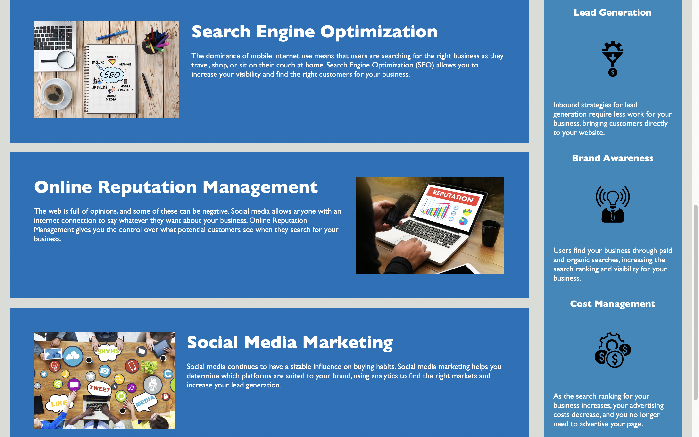

# semantic-accessible-page
An accessible marketing webpage with semantic HTML/CSS code.

## Description

___

This project was created to give an example of an accessible webpage that has semantic code. An accessible webpage means it was designed for all users, including those with disabilities. When it is read by a screen reader, the code is deciphered in a way that makes it more "accessible" to all users. An example of this is using *alt* attributes to describe images on the page. Semantic means the code is organized, spaced, and indented properly with specific and meaningful HTML tag names rather than broad ones. It also means the code includes comments and an organized CSS file with nicely grouped universal, element, class, and id selectors.

During this project, I learned a lot about organizing code and making it look better overall. A lot of time was spent changing HTML tags, properly setting class and id selectors, adding alt attributes to images, organizing the CSS file, and commenting on the code.

## Usage

___

Upon clicking the link to the webpage (see "Links" below), the user will be directed to a single page with pictures and text content about digital marketing. The user can navigate to each section using the nav bar links at the top right portion of the header.

## Links

___

Website URL:

* https://scottsc0de.github.io/semantic-accessible-page/

GitHub Repository:

* https://github.com/ScottsC0de/semantic-accessible-page

## Screenshots

___

